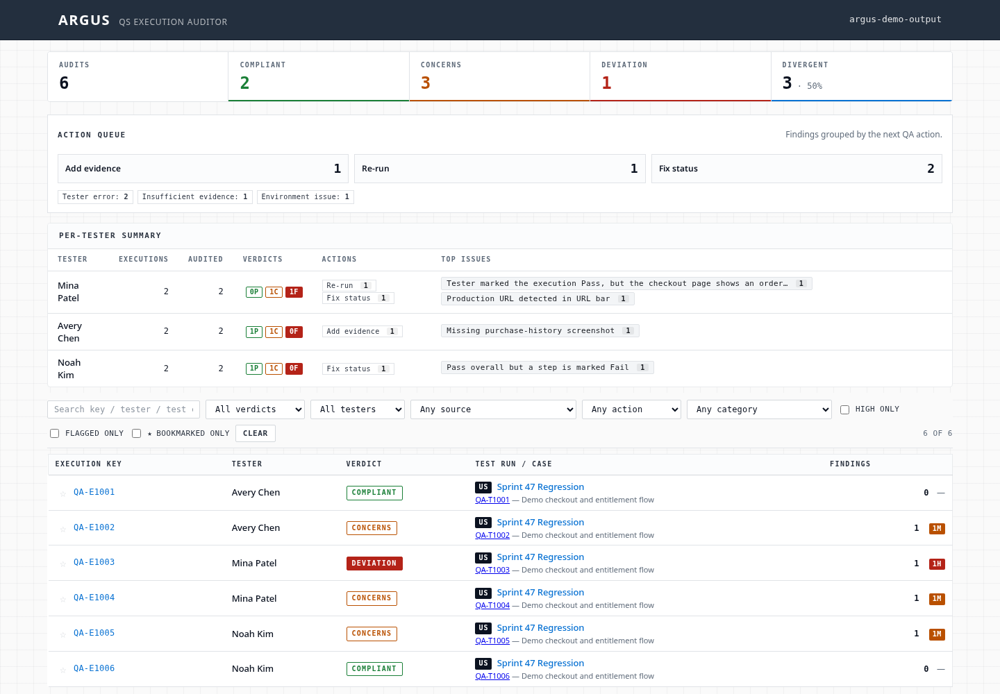
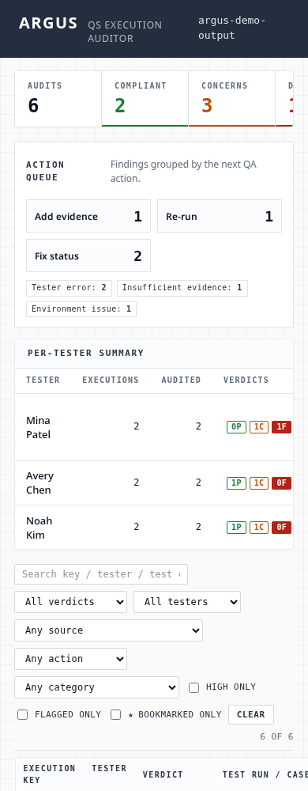

<div align="center">

# ARGUS

**AI-powered QA audit engine — runs LLMs inside your CI/CD pipeline to catch bugs humans miss.**

ARGUS plugs Claude, GPT-4, or Gemini into your test execution pipeline to automatically audit screenshots, test evidence, and execution metadata at scale. Built and battle-tested at Amazon, where it processes **5,000+ screenshots daily** in CI/CD, catching UI anomalies and logical defects before they reach production.

[](https://www.python.org/downloads/)
[](LICENSE)
[](tests/)
[](#model-providers)

</div>

---

## Why I built this

Manual QA review at scale is a lie. When your CI/CD pipeline generates thousands of screenshots per day, no human team reviews them all — things slip through. The existing visual regression tools (pixel diffing, snapshot testing) catch *changes* but not *correctness*: they can't tell you that a button label is wrong, a price is missing, or a layout makes no logical sense.

I built ARGUS at Amazon to fix this. It feeds QA execution evidence directly to an LLM (Claude in our case), which audits each screenshot and execution for semantic correctness — not just pixel differences. The findings land in a static HTML dashboard that any engineer can open in a browser, no server required.

**The result: 5,000+ daily screenshot audits running continuously in CI/CD, surfacing critical anomalies before production.**

<p align="center">
  
</p>

<details>
<summary>Mobile layout</summary>

<p align="center">
  
</p>

</details>

---

## What ARGUS does

- **Feeds screenshots + test metadata to an LLM** — Claude, GPT-4, Gemini, or any Bedrock-compatible model
- **Audits for semantic correctness** — catches wrong labels, missing elements, broken layouts, logical bugs that pixel-diff misses
- **Runs deterministic rule checks in parallel** — workflow validation that doesn't need a model call
- **Produces static HTML + Markdown reports** — no server, no database, open the file in a browser
- **Aggregates per-tester coverage** — see who tested what, what was missed, where the gaps are
- **Works offline** — all audit results are cached as JSON; rerun reports without re-calling the model

---

## Quickstart

```bash
scripts/bootstrap.sh          # create venv, install deps, scaffold config
$EDITOR .env.argus            # set tracker + model provider
scripts/bootstrap.sh          # regenerate config.toml from .env.argus
scripts/report.sh             # render a report from existing audit files
```

Open `$ARGUS_OUTPUT_DIR/_argus.html` in a browser.

---

## Installation

> **Requirements:** Python 3.11+

**Using [`uv`](https://github.com/astral-sh/uv) (recommended):**

```bash
scripts/bootstrap.sh
scripts/test.sh
```

**Using `pip`:**

```bash
python3 -m venv .venv
. .venv/bin/activate
pip install -r requirements.txt -r requirements-dev.txt
pytest -q
```

---

## Configuration

```bash
cp scripts/env.example.sh .env.argus
$EDITOR .env.argus
scripts/bootstrap.sh          # writes config.toml from .env.argus
```

| Variable | Purpose |
|----------|---------|
| `ARGUS_TRACKER_BASE_URL` | Base URL of your issue/test tracker |
| `ARGUS_PROJECT_ID` | Tracker project identifier |
| `ARGUS_OUTPUT_DIR` | Where reports and audit evidence live (default `./output`) |
| `ARGUS_MODEL_PROVIDER` | `openai`, `anthropic`, `google`, or `bedrock` |
| `ARGUS_MODEL_ID` | Provider-specific model identifier (e.g. `claude-sonnet-4-5`) |
| `ARGUS_API_KEY_ENV` | Name of the env var holding the API key |
| `ARGUS_ENV_CHECK_ENGINE` | Environment-validation engine (`off` by default) |

Set `ARGUS_API_BASE_URL` only when routing through a gateway instead of the provider default.

> [!NOTE]
> `.env.argus` and `config.toml` are git-ignored. Never commit credentials.

---

## Model Providers

| Provider | `ARGUS_MODEL_PROVIDER` | Default key env |
|----------|----------------------|-----------------|
| Anthropic (Claude) | `anthropic` | `ANTHROPIC_API_KEY` |
| OpenAI (GPT-4o, etc.) | `openai` | `OPENAI_API_KEY` |
| Google Gemini | `google` | `GOOGLE_API_KEY` |
| AWS Bedrock | `bedrock` | uses `region` / `cloud_profile` |

For Bedrock, set `ARGUS_MODEL_REGION` and `ARGUS_CLOUD_PROFILE` instead of an API key.

---

## Usage

### Audit a single test execution

```bash
scripts/run-audit.sh --key QA-E123456
```

### Audit an entire sprint folder

```bash
python argus.py --folder "Sprint 47 Regression"
```

Folder mode processes all unaudited executions in parallel. Already-audited keys (those with an existing `audit.json`) are skipped — safe to re-run.

### Generate / refresh the report

```bash
scripts/report.sh
```

Outputs:

```
$ARGUS_OUTPUT_DIR/_argus.html              # latest dashboard (open in browser)
$ARGUS_OUTPUT_DIR/_argus_<timestamp>.html  # timestamped snapshot
$ARGUS_OUTPUT_DIR/_report_<timestamp>.md   # Markdown summary
```

### Direct Python entry points

```bash
python argus.py --key QA-E123456                       # single execution
python argus.py --folder "Sprint 47 Regression"        # whole folder
python report.py --out-dir ./output/my-run --html      # report only
```

---

## How It Works

```
  tracker / evidence            ARGUS pipeline                  outputs
  ──────────────────            ──────────────                  ───────
  test executions   ──▶  extractor   ─┐
  screenshots                          ├─▶  auditor (LLM)   ─┐
  metadata                             │                      ├─▶  report  ──▶  HTML + Markdown
                                       └─▶  workflow_rules ───┘
                                            (deterministic)
```

1. **Extract** — `extractor.py` pulls execution metadata and screenshots from your tracker into a local output tree.
2. **Audit** — `auditor.py` sends evidence to your chosen LLM; `workflow_rules.py` runs deterministic checks in parallel.
3. **Report** — `report.py` renders the static dashboard from cached `audit.json` files — no model calls needed to re-render.

---

## Repository Layout

```
argus.py                 end-to-end runner
extractor.py             tracker ingestion
auditor.py               LLM audit orchestration
auditor_prompts.py       prompt library
workflow_rules.py        deterministic checks
report.py                HTML/Markdown report generation
report_assets/           dashboard CSS/JS
scripts/                 setup and run helpers
tests/                   unit and integration tests (mocked, runs offline)
```

See [SETUP.md](SETUP.md) for a step-by-step walkthrough.

---

## Development

```bash
scripts/test.sh     # run the suite via uv
pytest -q           # run directly
```

All external clients (LLM APIs, tracker) are mocked — the test suite runs fully offline with no credentials.

---

## Related projects

- **[OmniHeal](https://github.com/ivinitus)** — self-healing test gateway using Go + MCP that automatically rewrites broken Playwright/Selenium locators using local LLM agents
- **[zephyr-scale-mcp](https://github.com/ivinitus/zephyr-scale-mcp)** — MCP server for Zephyr Scale test management

---

## License

Released under the [MIT License](LICENSE).
